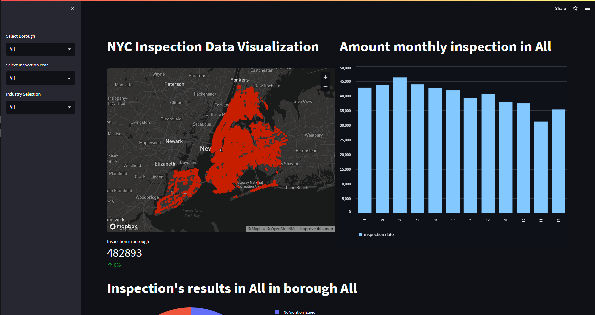

# NYC-Inspection-Data-Visualization-App

## Project Description

Create a web app that consists of data visualizations insight on New York City's Inspections.

## Python Libaries Used

[Pandas](https://pandas.pydata.org), [Numpy](https://numpy.org), [Matplotlib](https://matplotlib.org), [Streamlit](https://streamlit.io), and [Plotly](https://plotly.com/)

## Data Source

[NYC Open Data](https://data.cityofnewyork.us/Business/Inspections/jzhd-m6uv)
> A catlog of data of Airbnb from around the world updated quarterly

## File Directory
- ### index.py 
  > Location of the code for the web app and visualizations
- ### ./data/data.csv
  > Location of the the 11-25-22 data for NYC
- ### requirements.txt
  > Text file with details on enviroment requirements for the web app

## Future Updates

> To be determined

## How to Run Locally
- Download this repo and all packages mentioned in `requirements.txt`
- Go to terminal/command line and run the following command:
  `streamlit run index.py`
